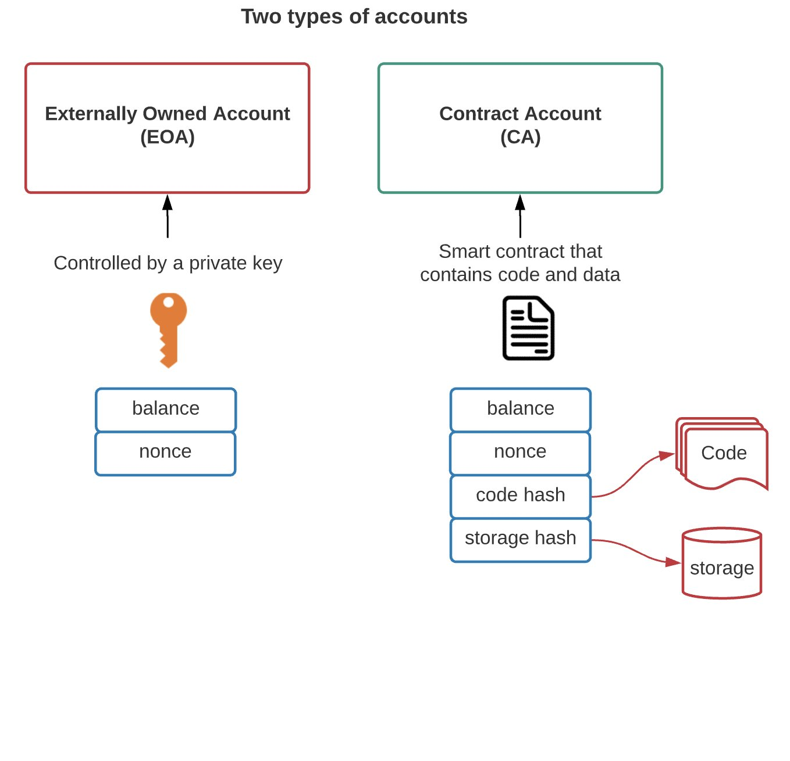
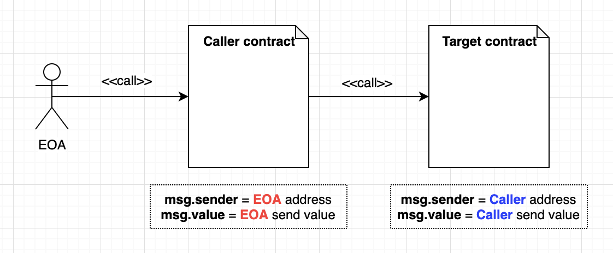
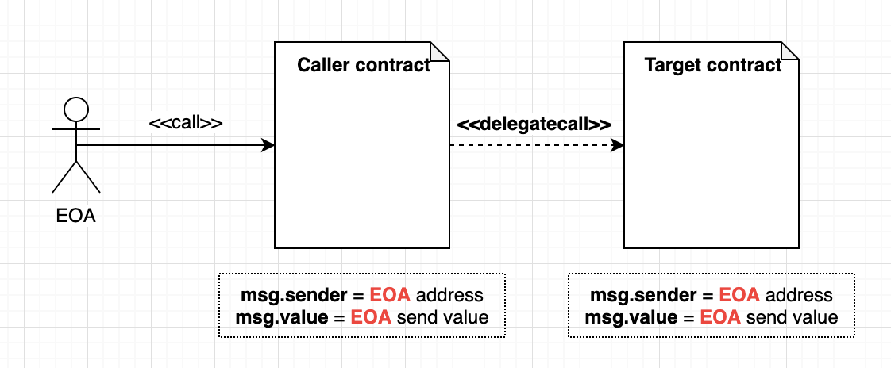
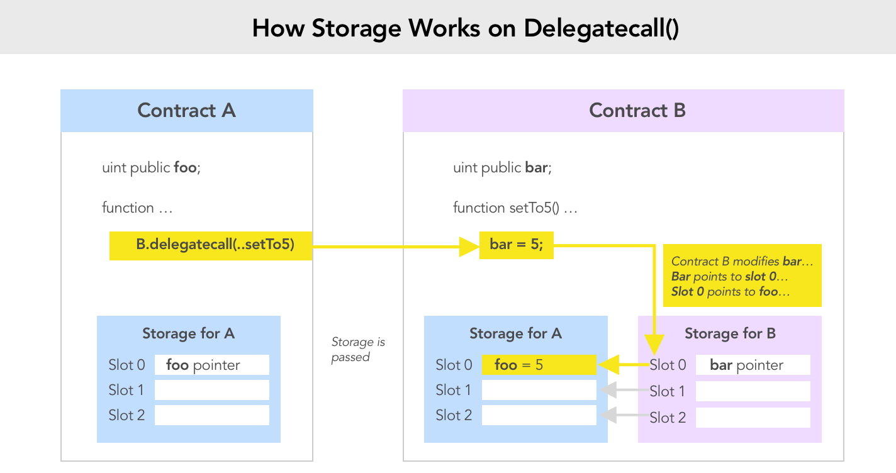
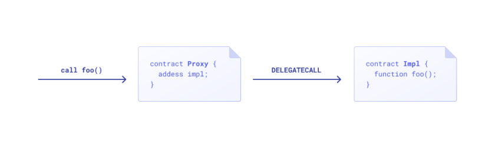
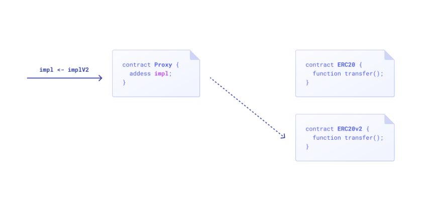

# **upgrade contract**

@seven

---

## outline

* introduce smart contract
* upgrade pattern
* writing upgradeable contracts

---

## Accounts

EOA VS Contract


---

## smart contract

* value
* storage
* code
  * immutable

### exception

* selfdustruct: delete code, storage and transfer value

---

## storage

low level: evm
high level: solidity

---

## EVM


---

* a simple stack based vm
* code execute from zero
* memory is temporary: lifetime is limited to an external function call
* storage is sustained: limited to the lifetime of a contract

---

### storage ops

* sload
* sstore

---

### storage structure

* map:
  * key and value are both 256 bits
* slot

---

## solidity code

[demo code](../demo/contracts/Demo.sol)

```solidity
contract Demo {
    string public name;

    constructor(string memory _name) payable {
        name = _name;
    }

    function hello() public view returns (string memory) {
        return name;
    }
}
```

```sh
npx hardhat run scripts/deploy_demo.js
```

---

## How to execute in solidity

* no main function
* bin Vs lib

---

## solidity

* no main function
* execute code from zero
* how to execute different function?

---

## function selector

* if match: jump to the code

```sh
❯ cast sig "transfer(address,uint256)"
0xa9059cbb
```

* selector clash

---

### solidity storage layout

[Layout of State Variables in Storage](https://docs.soliditylang.org/en/v0.8.17/internals/layout_in_storage.html)

---

## storage slot demo

```solidity
contract Storage {
    uint public a = 1;
    uint128 internal b = 2;
    uint128 internal _c;
    uint internal _d;
    uint[] public e = [1, 2, 3];
    mapping(uint => uint) public f;
    uint public g = 5;
}
```

```sh
cd demo
npx hardhat run --network local scriptss/depoly_storage.js
cast storage --help
```

---

### array address

```sh
❯ cast keccak 0x0000000000000000000000000000000000000000000000000000000000000003
0xc2575a0e9e593c00f959f8c92f12db2869c3395a3b0502d05e2516446f71f85b

❯ cast storage -r http://127.0.0.1:8545 0x1291Be112d480055DaFd8a610b7d1e203891C274 0xc2575a0e9e593c00f959f8c92f12db2869c3395a3b0502d05e2516446f71f85b
0x0000000000000000000000000000000000000000000000000000000000000001
```

---

### map address

```sh
# hash(key.slot)
❯ cast keccak 0x00000000000000000000000000000000000000000000000000000000000000010000000000000000000000000000000000000000000000000000000000000004
0xabd6e7cb50984ff9c2f3e18a2660c3353dadf4e3291deeb275dae2cd1e44fe05

❯ cast storage -r http://127.0.0.1:8545 0x1291Be112d480055DaFd8a610b7d1e203891C274 0xabd6e7cb50984ff9c2f3e18a2660c3353dadf4e3291deeb275dae2cd1e44fe05
0x0000000000000000000000000000000000000000000000000000000000000002

❯ cast keccak 0x00000000000000000000000000000000000000000000000000000000000000020000000000000000000000000000000000000000000000000000000000000004
0x91da3fd0782e51c6b3986e9e672fd566868e71f3dbc2d6c2cd6fbb3e361af2a7

❯ cast storage -r http://127.0.0.1:8545 0x1291Be112d480055DaFd8a610b7d1e203891C274 0x91da3fd0782e51c6b3986e9e672fd566868e71f3dbc2d6c2cd6fbb3e361af2a7                                                                  
0x0000000000000000000000000000000000000000000000000000000000000004
```

---

## pattern

* parameters configuration
* contracts register
* strategy pattern
* pluggable modules
* **upgrade pattern**

---

## parameters configuration

* simply tuning a set of parameters in contract
* not really update the code

---

## contracts registry

* central registry
* state need migrate mannully
* external client need to call into the registry before interacting with the contract

---

## strategy pattern

* Instead of implementing a function in your contract to take care of a specific task, you call into a separate contract to take care of that – and by switching implementations of that contract, you can effectively switch between different strategies
* only read state

---

## pluggable modules

* core immutable features
* most common in wallets
* can't fix core contract bug

---

## upgrade pattern

* library
* call Vs delegatecall

---



---



---



---

## Proxy



```solidity
contract Proxy {
    address implementation;

    fallback() external payable {
        (bool res, ) = implementation.delegatecall(msg.data);
        require(res, "Failed to delegatecall");
    }
}
```

---

## demo

```sh
❯ npx hardhat run --network localhost scripts/deploy_proxy.js
```

---

## upgradable



---

## upgradablee(continue)

```solidity
contract AdminUpgradeableProxy {
    address implementation;
    address admin;

    fallback() external payable {
        (bool res, ) = implementation.delegatecall(msg.data);
        require(res, "Failed to delegatecall");
    }

    receive() external payable {}

     function upgrade(address newImplementation) external {
        require(msg.sender == admin);
        implementation = newImplementation;
    }
}
```

---

## problem 1

* proxy vs logic function selector confict

```solidy
contract Foo {
    function collate_propagate_storage(bytes16) external { }
    function burn(uint256) external { }
}
```

---

## transparent proxy

```solidity
// Sample code, do not use in production!
contract TransparentAdminUpgradeableProxy {
    address implementation;
    address admin;
    fallback() external payable {
        require(msg.sender != admin);
        implementation.delegatecall.value(msg.value)(msg.data);
    }
    function upgrade(address newImplementation) external {
        if (msg.sender != admin) fallback();
        implementation = newImplementation;
    }
}
```

---

### Admin Contract

* create an admin contract

---

### downside

* gas cost. Each call requires an additional read from storage to load the admin address
* contract itself is expensive to deploy

---

## Universal upgradeable proxy

```solidity
// Sample code, do not use in production!
contract UUPSProxy {
    address implementation;
    fallback() external payable {
        implementation.delegatecall(msg.data);
    }
}
abstract contract UUPSProxiable {
    address implementation;
    address admin;
    function upgrade(address newImplementation) external {
        require(msg.sender == admin);
        implementation = newImplementation;
    }
}
```

---

benefit:

* no select clashes
* proxy is small
* less read from storage (check admin)

downside:

* may lock the logic contract

---

## unstructured storage pattern

* proxy vs logic storage conflict

```solidity
    /**
     * @dev Storage slot with the address of the current implementation.
     * This is the keccak-256 hash of "eip1967.proxy.implementation" subtracted by 1, and is
     * validated in the constructor.
     */
    bytes32 internal constant _IMPLEMENTATION_SLOT = 0x360894a13ba1a3210667c828492db98dca3e2076cc3735a920a3ca505d382bbc;
```

---

## logic contracts storage confict after upgrade

* storage variable append only, never delete
* padding reserve
* eternal storage pattern (proposal: solidity language direct support)

---

```solidity
// Sample code, do not use in production!
contract EternalStorage {
    mapping(bytes32 => uint256) internal uintStorage;
    mapping(bytes32 => string) internal stringStorage;
    mapping(bytes32 => address) internal addressStorage;
    mapping(bytes32 => bytes) internal bytesStorage;
    mapping(bytes32 => bool) internal boolStorage;
    mapping(bytes32 => int256) internal intStorage;
}
contract Box is EternalStorage {
    function setValue(uint256 newValue) public {
        uintStorage[‘value’] = newValue;
    }
}
```

---

## limit

* can't use constructors, use initializer

---

## EIP2535(Diamond Contract)

```solidity
// Sample code, do not use in production!
contract Proxy {
    mapping(bytes4 => address) implementations;
    fallback() external payable {
        address implementation = implementations[msg.sig];
        return implementation.delegatecall(msg.data);
    }
}
```

---

## Beacons

```solidity
// Sample code, do not use in production!
contract Proxy {
    address immutable beacon;
    fallback() external payable {
        address implementation = beacon.implementation();
        return implementation.delegatecall.value(msg.value)(msg.data);
    }
}
contract Beacon is Ownable {
    address public implementation;
    function upgrade(address newImplementation) public onlyOwner {
        implementation = newImplementation;
    }
}
```

---

## Abusing CREATE2 with Metamorphic Contracts

* create2
* selfdestruct

---

## openzepplin upgrade guide

---

## example

* bas
* demo

---

## Upgrade Governance

* EOA
* mulit-sig
* timelock
* pausable
* escape hatches
* commit-reveal upgrades
* voting

---

## refenence

[The State of Smart Contract Upgrades](https://blog.openzeppelin.com/the-state-of-smart-contract-upgrades/)
[Proxy Upgrade Pattern](https://docs.openzeppelin.com/upgrades-plugins/1.x/proxies)
[EIP-1967: Proxy Storage Slots](https://eips.ethereum.org/EIPS/eip-1967)
[EIP-1822: Universal Upgradeable Proxy Standard (UUPS)](https://eips.ethereum.org/EIPS/eip-1822)
[EIP-2535: Diamonds, Multi-Facet Proxy](https://eips.ethereum.org/EIPS/eip-2535)
